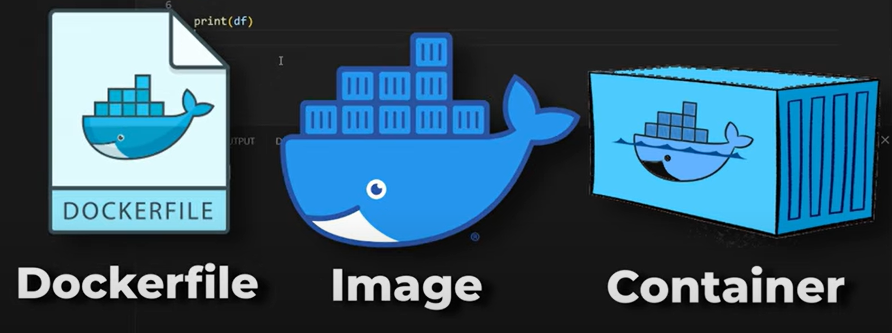

# Docker Nedir ve Nasıl Kullanılır? Python (FastAPI) ile Docker Örneği

[📺Kurs Video Linki](https://www.youtube.com/watch?v=ISdxKNCftKs)

**Dockerfile:** Adımları tek tek yazacağımız *dosya*. 

**Image:** Dockerfile a yazdığımız adımları takip ederek örneğin python ı indir, pandas ı indir gibi bu işlemleri tek tek yapıp çalıştırmak üzere hazır hale getirdiğimiz *paket*imiz.

**Container:** Hazırladığımız bu Image ı çalıştıracağımız *ortam*.
